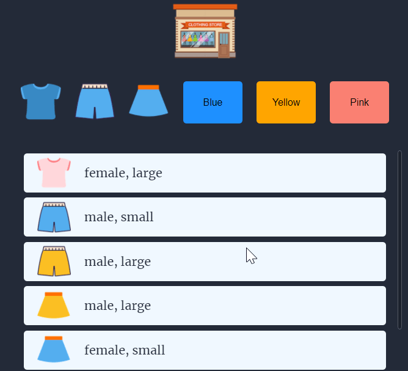
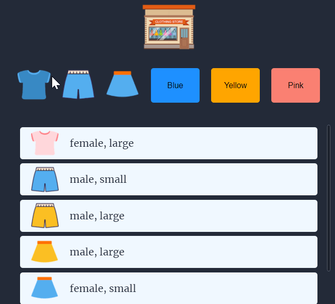
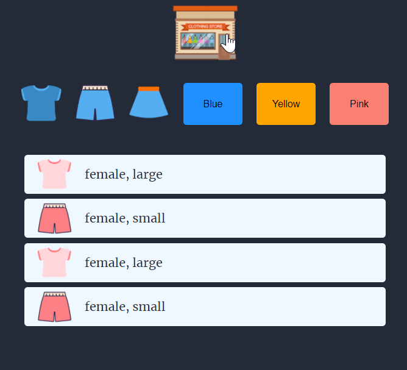

# 🛒 Mini Shopping Market

## 👀 Stacks
`HTML` `CSS` `JavaScript`   

## 🎯 Missons
- [x] Load data dynamically. Save the necessary data in the `json` file and load it using `async` `await`. 
- [x] Use event delegation
- [x] Add animation to the buttons
- [x] Make scroll bar in the item container
- [x] Filter items by type or color
- [x] Show all items when click the logo button

## 🚀 Main Features
### 1. Scrolling
  
  

### 2. Filtering
 
  

### 3. Logo button : Show all items  
  
  

## 🛠 Project References
[Youtube Dreamcoding by ellie](https://youtu.be/We2Kv1HMGvc, "Dreamcoding by ellie")

