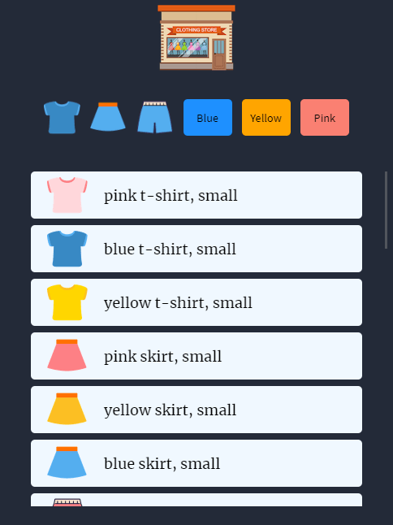
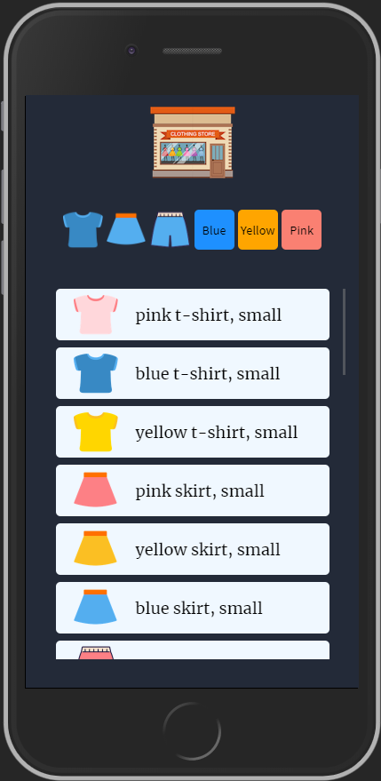
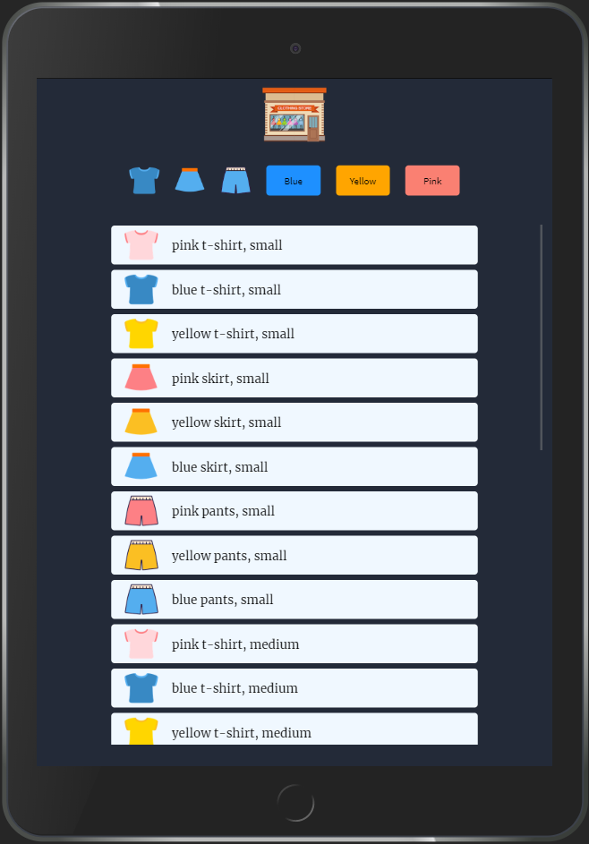
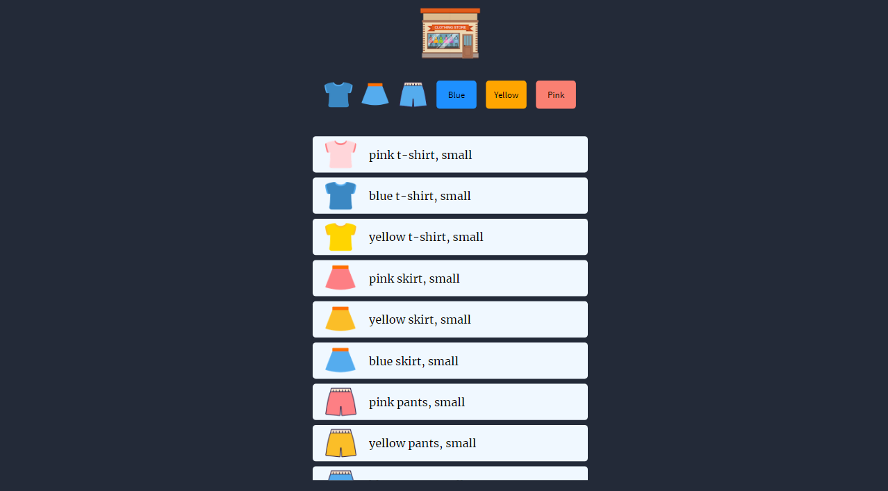

# Mini Shopping Mall
This is a mini project using javascript.  
I got these icon images from [Youtube Dreamcoding by ellie](https://youtu.be/We2Kv1HMGvc, "Dreamcoding by ellie"). 

  
If you click each icons, the items are filtered by the colors or the types of clothes.  
If you click the logo, everything's going back to its original state.  

## Mobile Screen

## Tablet Screen

## Laptop Screen

